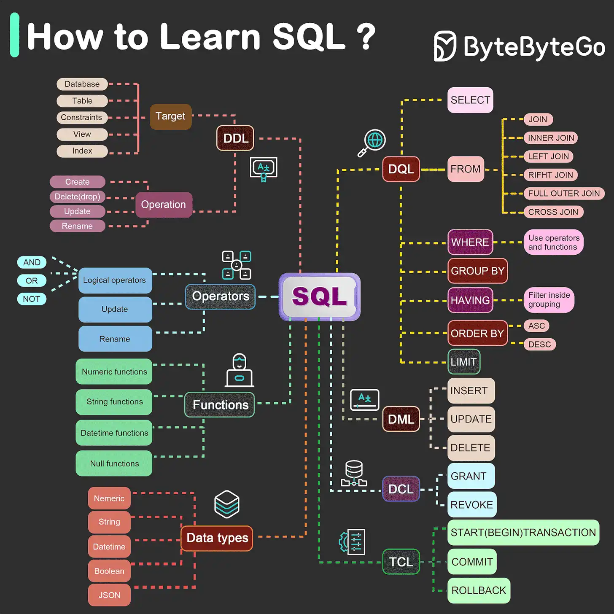

# 001_DB_QuerysSqlServer

Proyecto de Ejercicios SQL con SqlServer

## Descripción

En este proyecto, realizaremos ejercicios pequeños que servirán para armar un proyecto más grande.

## Objetivos

- Mejorar la velocidad en hacer querys
- Mejorar lógica de programación en sql
- Desarrollar el método inductivo en la realización de proyectos
- Planificar Ejercicios antes de desarrollar

## Tecnologías Utilizadas

- VSC
- MSSMS
- T-SQL

## Despliegue
- No

## Road Map

